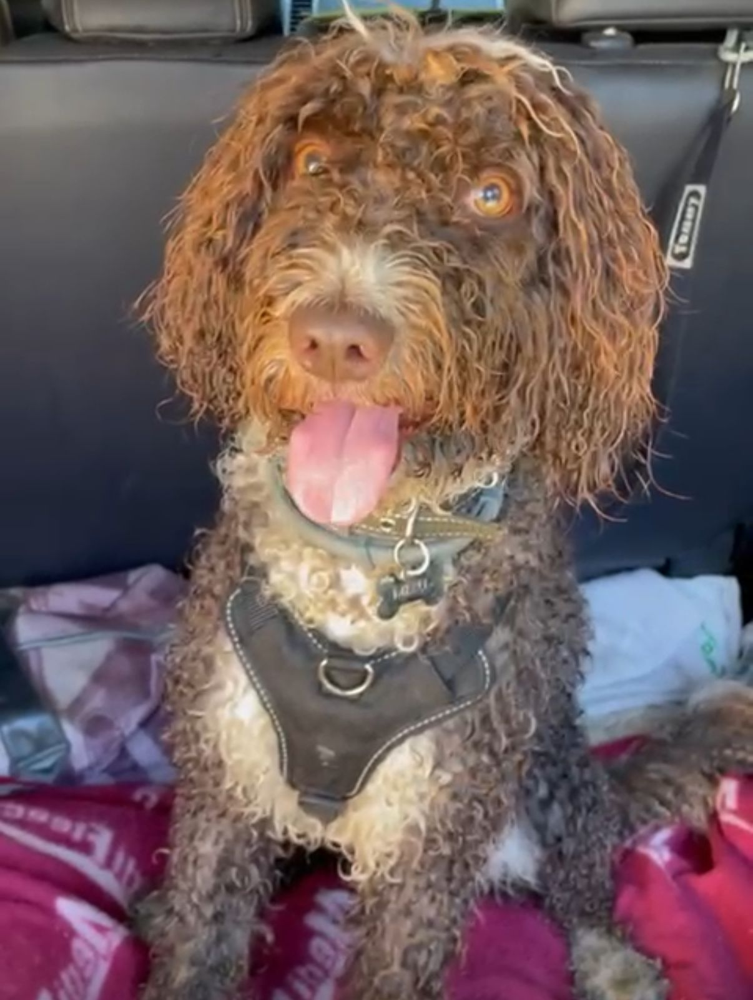
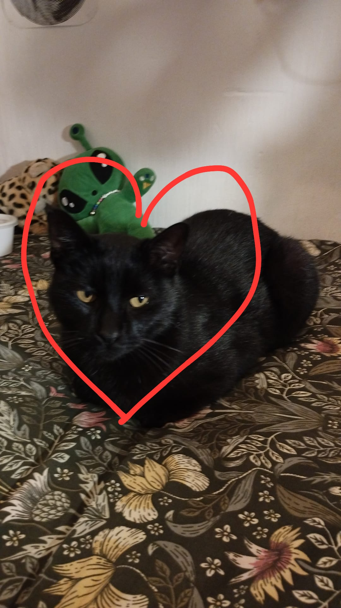

# Clasificador CNN: Gatos vs Perros 🐶🐱

Este proyecto entrena una **red neuronal convolucional (CNN)** para clasificar imágenes de **gatos y perros**. El modelo fue entrenado con un dataset de 7,300 imágenes preprocesadas y posteriormente probado con imágenes reales, incluyendo una foto de **mi perro** y una del **gato de un amigo**.

---

## 🧠 Descripción del Proyecto

- Se utilizó un dataset de **7,300 imágenes** divididas en dos clases: gatos y perros.
- Las imágenes fueron:
  - Redimensionadas a `256x256`
  - Convertidas a escala de grises
  - Normalizadas
- El modelo fue entrenado usando Keras con TensorFlow como backend.
- Posteriormente se evaluó con imágenes externas para validar su capacidad generalizadora.

---

## 📁 Estructura del Proyecto

```bash
ExerciseCNN/
├── dataset/ # Contiene las 7300 imágenes de entrenamiento
├── logs/ # Logs para TensorBoard
├── Cats&dogs.ipynb # Notebook principal de entrenamiento
├── CNN tests.ipynb # Notebook con pruebas usando imágenes reales
├── gatodesanti2.png # Imagen de un gato de un amigo (test)
├── mydog.jpg # Imagen de mi perro (test)
├── modelCNN.keras # Modelo CNN guardado
├── modeloDenso.keras # Variante de modelo denso (opcional)
└── README.md # Este archivo
```


---

## 🖼️ Imágenes de Prueba

Estas son las imágenes reales utilizadas para probar el modelo:

### 🐶 Mi perro:
<p align="center">
  
</p>

### 🐱 Gato de un amigo:
<p align="center">
  
</p>

> _Ambas imágenes deben estar en la raíz de `ExerciseCNN/` junto al `README.md`._

---

## 🧰 Librerías utilizadas

```python
import tensorflow as tf
import os
import numpy as np
from tensorflow.keras.applications.resnet50 import ResNet50, preprocess_input, decode_predictions
from tensorflow.keras.preprocessing import image
from sklearn.cluster import KMeans, DBSCAN
from sklearn.preprocessing import StandardScaler
import matplotlib.pyplot as plt
import cv2
from natsort import natsorted
from tensorflow.keras.callbacks import TensorBoard
```

## Acceso al modelo:
[CNN](https://drive.google.com/drive/u/1/folders/1_Sp6UW9eMSj_rKKkd-VeUDhuO_siYXV1)

[Modelo denso](https://drive.google.com/drive/u/1/folders/1_Sp6UW9eMSj_rKKkd-VeUDhuO_siYXV1)

**es importante que si se quieren probar los modelos, estos esten en el mismo directorio que el script que se vaya a usar para hacer los test**